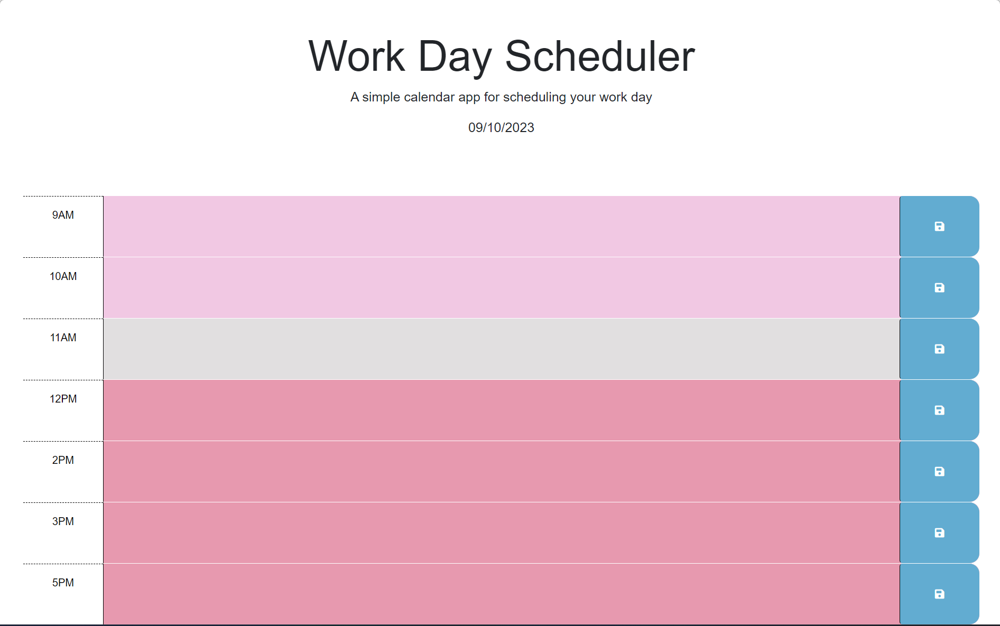

# Work Day Scheduler

## Desription

This webpage functions as a 'Work day calendar', in which the user is presented the current day's date, and time blocks for the hours of 9am-5pm, allowing for text input. When the user adds a note to any time block, they will simply need to click the save button to the right, and their notation will remain until they decide to remove and resave the empty block. Each time block will be colored to corespond with the user's present hour; past, present, and future time blocks will each have a different color. This allows the user to easily see how much of their workday has already passed, and how much is still left. 

While I know that I may not be using JQuery in any newly build applications, I know there's a big chance of me coming across older code using it and am thankful for the chance to now understand how it works. In addition to forming a base understanding of JQuery, this challenge also helped in deepening my understanding of Javascript as a whole; i.e: creating a function within an event listener, comparing variables, attributes to connect to HTML, and the use of local storage.

## Installation

No installation is required by the user to interact with this application.

## Usage

As a user of this site, I have a list of things I need to get done during the workday, and am looking for a way to easily organize and keep track of these things. With this site, I am able to enter any to-do or event into any time black, ranging from 9am-5pm. When I type something into the time block, I will press the save button to lock it into the calendar. Once I have completed this to-do/event, I will just delete the notation of it in it's time block, and resave the emply content. I am able to use this any day, as the date displayed at the top of the webpage will always match my calendar. 

### Static Page View

### Interactive Page View

### Link to Deployed Page

[Work Day Calendar](https://mmw18.github.io/Calendar-Module5/)